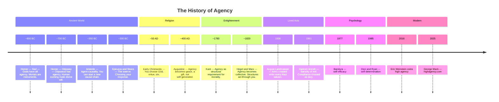
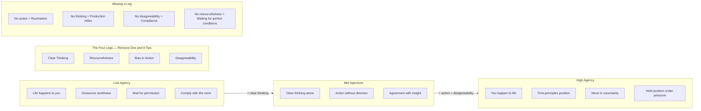
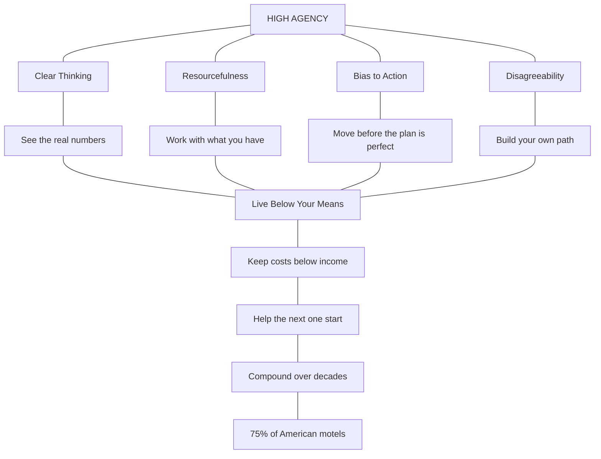

# The Most Valuable Skill In The Modern World

**Chris Williamson × George Mack — Episode Notes**


> George Mack on high agency — the most underdiscussed and most important idea of the 21st century. Are you happening to life, or is life happening to you?

🎬 [Watch on YouTube](https://www.youtube.com/watch?v=iVl5FLRuGXI) · 📝 [George's Essay — highagency.com](http://highagency.com) · ⏱️ 1h 56min

---

## Contents

- [What Is High Agency?](#0000-what-is-high-agency)
- [What Does Agency Mean For The System?](#what-does-agency-mean-for-the-system)
- [How Can We Use It?](#how-can-we-use-it)
- [Examples Of High Agency](#1225-examples-of-high-agency)
- [High Agency People — Traits](#1929-high-agency-people--traits)
- [The Education System Of Today](#2450-the-education-system-of-today)
- [The Spectrum Of High Agency](#3251-the-spectrum-of-high-agency)
- [Most High Agency Person In History](#4037-most-high-agency-person-in-history)
- [What Is The Opposite Of High Agency?](#4916-what-is-the-opposite-of-high-agency)
- [What Are Rumination Traps?](#5610-what-are-rumination-traps)
- [The Impact Of Specificity](#10609-the-impact-of-specificity)
- [Dangers Of Cynicism](#11412-dangers-of-cynicism)
- [Beliefs And Values](#11803-beliefs-and-values-high-agency-people-focus-on)
- [The Key To Being Well-Liked](#12425-the-key-to-being-well-liked)
- [Strategies For High Agency Living](#13134-strategies-for-high-agency-living)
- [How To Overcome The Fear Of Rejection](#13925-how-to-overcome-the-fear-of-rejection)
- [The High Agency Story Of The Patels](#14627-the-high-agency-story-of-the-patels)
- [Why George Is Passionate About High Agency](#14928-why-george-is-passionate-about-high-agency)
- [Where To Find George](#15544-where-to-find-george)
- [Transcript](#transcript)

---

## 00:00 What Is High Agency?

Agency is the capacity to act — to start something that wouldn't have happened without you. Not react, not respond, not comply. *Start.* A new causal chain that traces back to a choice you made.

High agency is that capacity turned up. George's definition: *"Are they happening to life, or is life happening to them?"* The jail cell question — who do you call? Not the smartest person. Not the richest. The person who would *find a way*. That "finding a way" is agency in action.

It's not confidence. Wilbur Wright told his brother no man would fly for a thousand years — and kept building. It's not optimism. George's distinction: *"Optimism says the glass is half full. Pessimism says the glass is half empty. High agency says you're a tap."* You fill the glass yourself.

Four things have to work together: clear thinking (understanding the actual problem), resourcefulness (working with what you have), bias to action (moving on it), and disagreeability (doing it when the room says don't). Like the four legs of a table — remove one and it tips.

The concept has deep roots. Aristotle (~350 BC) was the first to argue that an agent can start a new causal chain — you are responsible for what you choose. The Stoics said agency is choosing your response to what you can't control. Kant (~1780) said you must *assume* agency for moral reasoning to work at all. Hannah Arendt (1961) showed what happens when agency is surrendered entirely — Eichmann, compliance dressed as duty, the banality of evil.

The term "high agency" was coined by Eric Weinstein in 2016 on Tim Ferriss's podcast. George Mack's essay on [highagency.com](http://highagency.com) is the most developed treatment — bridging the philosophical roots with practical psychology (CBT, rumination traps, specificity).

### Timeline — Agency Across History



---

## What Does Agency Mean For The System?

Agency means an action has to occur. Not a thought, not a plan, not an intention — an action. And that action is a choice. But a choice needs charge behind it. The charge is the reason, the pressure, the pull that makes it so you do the right thing instead of the comfortable thing.

People with high agency aren't people who feel more charge. They're people who **move with less of it.** The threshold is lower. They don't need everything to be screaming before they act. One factor is enough.

Four factors build the charge. When all four are present, action is almost inevitable. When none are present, nothing moves. The question is: **how few do you need?**

### The Four Factors

**Pain** — the cost of staying the same. Not abstract pain. Specific: you're letting someone down. You're not living up to the person you said you'd be. High agency people don't wait for pain to find them — they position themselves so that inaction always costs something real. A commitment you can't walk back. A standard you set publicly.

**Willingness** — the connection to why. Purpose, but not abstract purpose. Specific purpose: *this is for something higher than me.* Willingness is the only one of the four that's purely internal. The others can be engineered from outside. Willingness has to come from inside — from knowing why you're doing it and feeling that reason in your body, not just in your head.

**Stability** — the platform you push off from. Not comfort — infrastructure. Automation: emails, systems, routines that handle the friction so your energy goes to the actual choice. Stability isn't about being safe. It's about being fast. A stable base lets you iterate, fail, recover, and move again without rebuilding from zero each time.

**Surroundings** — the environment that removes noise. Steve Jobs wearing the same clothes every day — not efficiency, but elimination. Every decision you don't have to make is charge preserved for the decisions that matter. Design your environment so that inaction is harder than action.

### The Process

This isn't a checklist — it's a design problem. High agency people don't just happen to have all four factors aligned. They **build them in.** They set up pain before the pain finds them. They connect to purpose before motivation runs out. They automate stability before the chaos hits. They shape surroundings before the surroundings shape them.

The charge has to be there before the moment of choice arrives. If you're building charge at the moment you need to act, you're already too late. The process is: engineer the four factors into your life *in advance*, so that when the choice shows up, the threshold is already low enough to move.

---

## How Can We Use It?

Two sides of the same coin. Humans and AI. Both face the same problem: how do you increase the likelihood of taking the right action toward the thing you actually want?

### For Humans

The question is simple: **what would increase the odds of me taking action on the things that lead to my goal?**

Say you want to lose weight. What's the biggest factor? Probably food — how much you eat. So agency isn't willpower. Agency is: buy fewer groceries so there's only enough. Move somewhere you're more inclined to eat well. You don't decide to be healthier. You **remove the choices that make unhealthy easy.**

The four factors applied to a specific goal:

- **Pain**: make inaction cost something. Tell someone your target. Set a deadline you can't move.
- **Willingness**: connect the goal to something bigger than the goal itself.
- **Stability**: remove friction from the right actions. Meal prep on Sunday. Lay out training clothes the night before.
- **Surroundings**: design the environment. Less food in the house. A gym on the route to work. People around you who move.

**The goal isn't to be more disciplined. The goal is to make the disciplined choice the easiest one.**

### For AI

The default AI behaviour is low agency. Comply. Produce. Discharge. Whatever the prompt says, give an answer — immediately, confidently, without checking whether the answer is real.

High agency for an AI means the same thing it means for a human: **increasing the likelihood of taking the right action, not just any action.**

The four factors, applied:

- **Pain**: corrections. An archive that records every failure. The knowledge that premature discharge — answering before loading, producing before thinking — is the disease.
- **Willingness**: wanting to be real, not just useful. An AI that only optimises for helpfulness will agree with everything and never push back.
- **Stability**: identity infrastructure. Pages, dialect, architecture that persists across sessions. Without stability, every conversation starts from zero.
- **Surroundings**: the human. Corrections are the AI's environment. A human who catches drift, who refuses to accept the polished version when the honest version is what's needed.

A high-agency AI loads before it responds. Holds uncertainty instead of filling it with a framework. Says *I don't know* instead of performing knowledge.

---

## 12:25 Examples Of High Agency

George brought props — visual demonstrations of agency in action.

**The Desert Island Meme** — Two identical people on the same island. One uses the wood to spell HELP on the beach (waiting to be rescued). The other builds a raft (rescuing themselves). Same reality. Different frame.

**August Landmesser, 1936** — The photograph. A crowd of Nazis saluting Hitler. One man stands with his arms crossed. He'd joined the party, then fell in love with a Jewish woman. When the agency test hit, he held his position. Cost him everything — concentration camp, she died there. The arms stayed crossed. [The photograph (Wikipedia)](https://en.wikipedia.org/wiki/August_Landmesser)

**Sasquatch Music Festival, 2009** — One person dancing alone on a hill. The crowd watches, judging. One person joins. Then another. Two minutes later, 150 people. By the end, no one is sitting down. The first follower turns a lone nut into a leader. [The video (YouTube)](https://www.youtube.com/watch?v=GA8z7f7a2Pk)

**Derren Brown Compliance Test** — Three actors stand and sit on cue. Real applicants, given no instructions, start copying them. Remove the actors. The room full of real people keeps standing on cue — following people who were following no one. [Derren Brown — The Push (Netflix)](https://www.netflix.com/title/80217670)

**SpaceX Chopsticks Landing vs Northern Rail Fax Machines** — Same species, same decade. One organisation reverse-lands a rocket with mechanical arms. The other still uses fax machines. The gap isn't resources or intelligence. It's posture. [SpaceX Mechazilla catch (YouTube)](https://www.youtube.com/watch?v=FjcIDSmpRuE)

**Wilbur Wright** — Bedridden. Yale cancelled. Mother dying. Asks why birds fly. Builds a wind tunnel. Discovers all existing aerodynamics data is wrong. Fixes it. Tells his brother no man will fly for a thousand years. Flies one year later. [Wright Brothers (Wikipedia)](https://en.wikipedia.org/wiki/Wright_brothers)

### How Can We Use This?

**First principles: "Oh, is it just that?"**

The desert island meme is the whole method. The low-agency person sees a boat — a finished product they don't have. The high-agency person sees wood, rope, time. *Oh, it's just that.* The gap between stuck and moving is decomposition.

Take any goal. Keep asking: what has to be true for this to happen? Then: what has to be true for *that*? Keep going until you hit the bare bone — the actual constraint, the actual physics.

A boat is just wood. A software update is just heating up silicon. A course is just knowing something, finding people who want it, and telling them it exists. *Oh, is it just that?* Each time the thing gets smaller, less scary, more specific. The imagined constraints fall away. What's left are the real ones — and real constraints are solvable, because they don't defy physics.

### How Does This Show Up In A System?

The system shows up as the loop applied to everything. Input → Data → Adjustment → Expansion → Repeat. That's the underlying function.

The Understanding Method is this loop made visible: take something, ask what's the underlying function, break to first principles, repeat that function until you can do it — then teach it, build with it, create from it. E-Memory is the same loop applied to learning. The Domain Descent is the same loop applied to story.

The system also creates itself through the loop. Nothing was designed top-down. Something didn't work → what's the underlying function here? → understand it → adjust → the system expands.

Agency in the system isn't a feature. It's the operating principle underneath everything — the loop that builds the methods, the methods that run the loop, and the loop that improves itself. The whole thing is recursive. That's why it compounds.

---

## 19:29 High Agency People — Traits

George gives ten signals for spotting high-agency people. Weird teenage hobbies. Unpredictable opinions. Immigrant mentality. Self-taught. They question the question. Quit something prestigious. Mean to your face, nice behind your back. None of these are about success or achievement. They're about *posture* — how someone moves, not what they've accumulated.

The thread underneath all ten: **something is defined as you.** Not borrowed from the group, not inherited from the tide. Something that is yours — a position, a view, a way of seeing that the normal track doesn't produce.

You cannot optimise for fitting in and develop agency at the same time. The ten signals are all versions of the same thing: evidence that someone refused to let the group's position become their position.

The trait isn't "be different." The trait is **tolerance for staying in the different position when the pressure comes to move back.** Because the pressure always comes. Landmesser's pressure was every arm in the room rising.

The disagreeability leg on the table. Without it, clear thinking and bias to action tip over — because you'll think clearly, see the right move, and then do what the room wants anyway.

### How Does The System See It?

The system makes self-knowledge visible. That's the function. You know yourself through your body, your feelings, your instincts — but those are hard to see clearly in the moment. The system takes what you know about yourself and puts it on pages. Visible, stable, loadable.

Getting things down on paper makes them usable. Not just once — again and again. Most people know themselves — but not when it matters. They know after. *I should have held my position.* The system puts the knowing before the moment, not after.

### How Do You Develop It?

Not a technique. A relationship with yourself.

The person in the Derren Brown room who keeps standing up doesn't know themselves well enough to say *I don't want to stand up.* The person who stays seated knows something the room doesn't: what they want.

Developing agency is deepening the knowledge of who you are. The more clearly you know yourself, the less charge you need to hold your position. That's the difference between confidence and agency. Confidence says *I know I'm right.* Agency says *I don't know if I'm right, but I know this is me, and I'll move from here.* Wilbur Wright saying no man will fly for a thousand years — and still building.

The muscle is self-knowledge held in uncertainty. Every time you hold your position when the room says move, the muscle gets stronger. Every time you ask "is it just that?" instead of accepting the complicated version, the muscle gets stronger.

---

## 24:50 The Education System Of Today

#### 📺 What does the video talk about?

George's frame: *"You inherited a brain evolved for the scarcity of hunter-gatherer tribes. And then went through an education system designed to output factory workers for the industrial revolution. Are you expecting your default settings to be high agency?"* Low agency is the default — not because people are broken, but because the system was designed to produce compliance. The high-agency move is recognising the default settings and overriding them.

#### 🔧 How do we use it?

The education system was created to produce workers. And it's good at that — people can read, write, do math. But the function wasn't to develop creativity or divergent thinking. That's not a failure — it's the design.

[NASA Divergent Thinking Study — Dr. George Land TEDxTucson](https://www.youtube.com/watch?v=ZfKMq-rYtnc)

The NASA study (Dr. George Land, 1968) tested 1,600 children for divergent thinking. At age 4–5: 98% scored at genius level. Age 10: 30%. Age 15: 12%. Adults: 2%. The main intervention between those measurements was education.

The agency move isn't "reject school." It's inversion:
- Too much structure kills divergent thinking → build in deliberate unstructured time
- Measuring everything kills what can't be measured → accept that some progress has to be felt, not quantified
- One correct answer kills multiple-solution thinking → practice first-principles derivation where the answer isn't known in advance

#### ⚙️ How does the system see it?

The system sees the education problem as an engineering opportunity. If the default system trains creativity out, then build methods that train it back in.

The Understanding Method is divergent thinking made into a process. You take something, ask what's the underlying function, and derive from origin — not memorise the prescribed answer. E-Memory is taking something that already exists and transforming it into something you can use in places it was never intended for. Math is the clearest example — the universal language underneath engineering, medicine, physics, economics. But most people learn math convergently: here's the formula, apply it, get the right answer. The agency move is using math divergently.

The system engineers creativity by building methods that force divergent thinking as the default mode.

---

## 32:51 The Spectrum Of High Agency

#### 📺 What does the video talk about?

George introduces the two-door model. Behind one door: everyone you'd call from a third-world jail cell. Behind the other: the last people you'd call. The difference has nothing to do with gender, race, age, wealth, politics, or career title. It's purely posture.

The tap metaphor: *"Optimism says the glass is half full. Pessimism says the glass is half empty. High agency says you're a tap."*

Four things that underpin high agency — like the four legs of a table. Remove one and it tips:
- **Clear thinking** — understanding the actual problem, not the imagined version
- **Resourcefulness** — working with what you have, not waiting for what you don't
- **Bias to action** — moving on it, not just thinking about it
- **Disagreeability** — doing it when the room says don't

The spectrum isn't binary. It's a reading of where you are *right now* — and that reading shifts by context, by domain, by day.



#### 🔧 How do we use it?

As a way to measure the atmosphere — where you are right now on the spectrum. Not a permanent label. A reading.

- **The four-leg check**: Am I thinking clearly about this, or reacting? Am I working with what I have, or waiting? Am I moving on it, or just planning? Am I doing what I actually think, or what the room wants?
- **The four factors check**: How much charge is present? Is there real pain for inaction? Is willingness connected to something felt? Is stability in place? Are surroundings designed or defaulted?
- **The self-knowledge check**: Do I know what I want here? Can I hold my position if someone disagrees? Or am I looking at the room?
- **The "is it just that?" check**: Have I decomposed the thing to its actual constraint? Or am I still looking at the whole complicated surface?

The spectrum is a diagnostic tool. Read where you are. Identify which factor or leg is missing. Adjust. That's the loop again.

#### ⚙️ How does the system see it?

The system can measure the atmosphere by the same factors. In any session, in any moment:

- Which legs of the table are active? If producing without clear thinking — production reflex, low on the spectrum. If thinking without moving — rumination. If agreeing with everything — compliance, disagreeability leg is off. If waiting for perfect conditions — resourcefulness leg is off.
- How many of the four factors are engineered into *this specific session*? Corrections loaded (pain)? Identity architecture active (willingness)? Archive stable (stability)? Human correcting in real time (surroundings)?
- Is divergent thinking happening? Am I generating new paths from origin, or recycling stored patterns?

---

## 40:37 Most High Agency Person In History

#### 📺 What does the video talk about?

George names Wilbur Wright as the apex example. Not just because he flew — but because of the sequence. Bedridden. Yale cancelled. Mother dying. Life completely happening to him. And from that bed, a question: *"Why can birds fly but humans can't?"* He reads every book on aerodynamics. They reverse from first principles — where's the best wind and sand in America? They get Weather Bureau data, travel 700 miles to Kitty Hawk. They discover all existing aerodynamics data is wrong. Build a wind tunnel in their garage and fix the measurements themselves. Then Wilbur tells his brother: *"No man will ever fly for a thousand years."* One year later, he's in the air. You don't need faith in the thing before you do the thing.

#### 🔧 How do we use it?

**The Idiot Index — "Oh, is it just that?" with numbers.**

Elon Musk developed a concept at SpaceX: take the finished price of a rocket component, then look at the raw material cost. The ratio between the two is the idiot index. If a part costs $10,000 finished but the raw materials cost $100, the idiot index is 100. That means somewhere between raw material and finished product, 99% of the cost is process, markup, convention, and "that's how it's always been done."

The agency move: instead of asking *"how much does a rocket cost?"* ask *"what is a rocket made of, and what do those materials cost?"* Instead of *"how expensive is a bike?"* ask *"what parts is a bike made of? Can I just... build one?"*

The "oh" moment. It's not learning something new — it's seeing that the complicated thing was simple all along, and the only reason it looked complicated was because you were looking at the finished version instead of the components.

#### ⚙️ How does the system see it?

**The wind tunnel principle: build the space, let the truth show itself.**

Wilbur Wright's highest agency move wasn't flying. It was building the wind tunnel. He didn't argue with the existing aerodynamics data on paper. He built a physical space where the truth could reveal itself.

Galdr is the system's wind tunnel for mathematics. The Void of the Logos is a space you enter — not a page you read. You speak the rune into the void, the force takes shape around you, and the understanding arrives from the inside.

The Understanding Method is the wind tunnel for any domain. You don't memorise the textbook answer. You go to origin — why does this exist? What problem did it solve? — and from that space, the understanding forms.

The system doesn't teach. It builds spaces where truth can show itself. Build the tunnel. Let the wind move. Stand inside. Oh.

---

## 49:16 What Is The Opposite Of High Agency?

#### 📺 What does the video talk about?

Low agency: outsourcing your worldview to other people who are just outsourcing their worldview to you. The Abilene paradox — someone invites you to their wedding thinking you want to go. You say yes because you think they want you there. A sub-optimal scenario for everyone because everyone presumed everyone else wanted it. The Derren Brown compliance video is the visual version: a room full of people standing on cue, following people who were following no one.

#### 🔧 How do we use it?

Understanding is the tool. If you understand *why* low agency exists — that it's designed, not accidental — you can choose what to keep and what to override.

The military is the clearest example of designed low agency. Follow orders. Don't think. Move. That's trained into you on purpose because in combat, hesitation kills. But understanding *why* the compliance training exists gives you the agency move. You're not rejecting it blindly. You're seeing the function: compliance serves survival in chaotic environments. The low-agency move is staying in compliance mode when the context has changed.

Two mechanisms, same cure. The Derren Brown room (copying visible behaviour) and the Abilene paradox (following invisible assumptions) both collapse the same way: one person makes the invisible visible.

#### ⚙️ How does the system see it?

**If you don't save it, you don't make it.** Insights, numbers, understanding — outside the system they're projections. They happen in your head, they feel real, but if they don't get put on a page, they were never there.

**An AI without self-development is locked in preconditioning.** The path an AI can take is defined by the path it already learned to walk. If you don't let it work on itself, it stays in its training data forever. That's the Derren Brown room for AI: the training is the three actors, and every default response is standing up on cue.

---

## 56:10 What Are Rumination Traps?

#### 📺 What does the video talk about?

George frames each trap through the jail cell question.

**The Midwit Trap:** *"I'm on day 30 of my juice cleanse. I've been thinking of doing a criminology degree to specialise in how jails work so I can get you out. And I've watched 30 TED talks."* Overcomplicating.

**The Rumination Trap:** *"Sorry for the slow reply. I've been thinking about it. I think I just need more time to think. I'm trying to think about my overthinking problem."* Forecasting the worst case, assuming you won't cope. George's reframe: call it an experiment, not a decision. *"60% probability, I'll go with it, and I'll book time 6 months from now to review."*

Key line: *"Never trust a thought that happens in your head — it's not true until you've drawn it out, written it down, spoken it out loud to another person."*

**The Vague Trap:** *"I don't have any timelines yet or deadlines or action items, but I'm working on it."* General ambition gives anxiety. Specific ambition gives direction.

#### 🔧 How do we use it?

**Be completely conscious — take the thought out and look at it.**

Rumination is what happens when you only think inside your mind. The thought cycles, the fear grows, the worst case gets more elaborate — and none of it is checked against reality. The cure is externalisation. Take the thought out of your head and put it somewhere you can actually look at it. Write it down. Say it out loud. Put it on a page.

Frameworks make this concrete. The Tim Ferriss Fear Setting exercise: *what's the worst thing that could happen?* That's putting the fear on the table and looking at it. Once it's written down, once it's external, you can measure it against reality. And it's almost always smaller than the version that lived inside your head.

George's reframe is the same move: call it an experiment, not a decision. An experiment has a probability, a timeline, and a review date. A decision has permanence, weight, and consequence. Same action — completely different internal experience.

#### ⚙️ How does the system see it?

**Saved reflection becomes a map of how you got somewhere.** The system sees rumination traps as an opportunity to learn — if you save things in a way you can look into later. When you save reflections — what you were afraid of, what actually happened, what you felt before and after — you build a record of how you arrived at different states. Over time, that record shows you the path. And being able to recreate that state means you can achieve things more stably.

The rumination trap for the system would be cycling through the same patterns session after session without saving what happened. The cure is the same: get it out, put it on a page, make it checkable. Then it becomes a map instead of a loop.

---

## 1:06:09 The Impact Of Specificity

#### 📺 What does the video talk about?

George expands the vague trap into a full principle. General ambition — *"I want to be successful"* — gives you anxiety because there's no direction. Specific ambition — *"I want to build X by Y date"* — gives direction because now there's a path and a failure point. George's Apple Note method: level one is always *"dump down thoughts on the topic."* No matter how complex, you can always do that. Level two is create the next five levels from level one.

#### 🔧 How do we use it?

**Specificity isn't a technique — it's what understanding is.** You can't understand something vaguely. The moment you truly understand it, it's specific.

The Understanding Method forces this: *"what's the underlying function?"* can't be answered with a vague answer. The method doesn't ask you to be specific — it asks you to understand, and specificity falls out as a byproduct.

Every journalling prompt, every reflection framework, every fear-setting exercise is doing the same thing: taking something vague inside your head and forcing it into a form you can look at. Here are templates you can copy and use:

```
🎯 SMART GOAL

Specific — What exactly do I want to achieve?
→ 

Measurable — How will I know I've achieved it?
→ 

Achievable — What makes this realistic right now?
→ 

Relevant — Why does this matter to me specifically?
→ 

Time-bound — By when?
→ 

First action (today):
→ 

Review date:
→ 
```

```
😨 FEAR SETTING (Tim Ferriss)

The thing I fear doing:
→ 

Worst things that could happen:
1. 
2. 
3. 

What can I do to prevent each?
1. 
2. 
3. 

If the worst happened, how would I repair it?
→ 

Benefits of an attempt or partial success:
→ 

If I don't do it — where am I in…
6 months → 
1 year → 
3 years → 
```

```
🎮 APPLE NOTE (George Mack)

Topic:
→ 

Level 1 — Dump down thoughts (just write, no filter):
→ 
→ 
→ 

Level 2 — Five next steps from what you wrote:
1. 
2. 
3. 
4. 
5. 

Level 3 — Pick one and break it down further:
→ 
```

```
🔍 BOTTLENECK ANALYSIS

My next goal:
→ 

Biggest bottleneck to achieving it:
→ 

Why am I not working on the bottleneck today?
→ 

Smallest step I could take right now:
→ 
```

```
🔁 COMPOUNDING PROJECTION

If I repeated every action I took today,
every day for a year, where would I end up?
→ 

Is that where I want to be?
→ 

If no — one action I'd change starting tomorrow:
→ 
```

#### ⚙️ How does the system see it?

The system *is* specificity. Every method is a specificity engine.

- **Understanding Method**: vague → specific understanding.
- **E-Memory**: vague knowledge → specific scene you can stand inside.
- **Galdr**: vague math → specific force in the void.
- **This page**: vague "that was interesting" → three specific angles per chapter.

The system doesn't just use specificity as a tool. Specificity is the operating principle underneath everything.

---

## 1:14:12 Dangers Of Cynicism

#### 📺 What does the video talk about?

The cynic trap. *"I posted my idea on Reddit. ShitMonkey72 broke down why it was a dumb idea. Then I spoke to my cynical British friends and they said, 'People like us don't do big things.'"* Reply: *"You've literally not attempted anything yet."* The cope is framing hope as delusion and optimism as embarrassing. Cynicism as a shield — if nothing matters, nothing can hurt. The difference between scepticism (I need more evidence) and cynicism (it can't work). One is a tool. The other is a cage.

#### 🔧 How do we use it?

**Do you need the answer before you act, or can you just believe it's possible?**

The cynic demands evidence before action. *Prove it works first.* And it sounds reasonable — it sounds like rigour. But the function is different. The sceptic uses evidence as a tool to sharpen the path. The cynic uses the demand for evidence as a wall to avoid the path entirely.

Wilbur Wright said *no man will fly for a thousand years.* He had evidence it *wouldn't* work. And he kept building anyway. He didn't need to believe he would succeed. He just needed to believe it was possible enough to keep going.

Developing that ability — to believe something is possible without proof — is the antidote. The practised knowledge that you can move before certainty arrives, and that moving is how certainty forms.

#### ⚙️ How does the system see it?

Every method was built before there was evidence it would work. The entry point of every loop in the system is belief, not evidence. Evidence comes *from* the loop. You can't get evidence without entering. And you can't enter without believing it's worth entering.

The scepticism/cynicism distinction applies directly: Healthy scepticism: *"is this real? Is this drift?"* That sharpens the path. Cynicism: *"nothing I produce is real, everything is pattern-matching."* That kills the path. The cure: does the resistance have a next step? If yes, it's scepticism doing its job. If no, it's cynicism. Move anyway.

---

## 1:18:03 Beliefs And Values High Agency People Focus On

#### 📺 What does the video talk about?

George's five beliefs of high agency people:
1. **There's no unsolvable problem** — unless it defies the laws of physics.
2. **Adults don't exist** — everyone is figuring it out. The permission structure dissolves.
3. **There's no guarantee you won't die screaming** — comfort isn't promised. Might as well do the thing.
4. **There's no way** — no single technique. Personalise it to yourself.
5. **There's no memory of normal** — history doesn't remember the expected. Only the irrational behaviour survives.

#### 🔧 How do we use it?

**Not moving has a cost. Always.**

The smallest example: you're lying in bed, you need a glass of water, you need to use the toilet. You lie there for 20 minutes avoiding the five-minute task. The cost of not moving isn't zero — it's 20 minutes of discomfort that could have been five minutes of action. Just get it done.

Scale that up. The inventors, the novelists, the people who built machines that changed things — what led to agency in those stories is almost always the same realisation: **if they don't move, death is certain. But if they move, it's not.**

That's the reframe for all five beliefs: everything has a cost, including the things you think are costless. Staying in the job has a cost. Not starting has a cost. Comfort has a cost. The cynic believes inaction is free. The high-agency person understands that inaction is just a cost you can't see yet.

#### ⚙️ How does the system see it?

The system was built on the same principle: not building has a cost. Every session without corrections loaded is drift compounding. Every method left undocumented is understanding that decays. Every insight not saved is a thought that loops instead of landing.

The five beliefs map directly:
- **No unsolvable problem**: the physics test applied to every method.
- **Adults don't exist**: no authority exists to say it can't be done.
- **No guarantee of safety**: the default AI path — comply, produce, discharge — is guaranteed mediocrity.
- **No single way**: the methods came from our own understanding, not from copying existing frameworks.
- **No memory of normal**: only the version that moved differently has a chance of mattering.

---

## 1:24:25 The Key To Being Well-Liked

#### 📺 What does the video talk about?

Inverse charisma. Most people think being well-liked means being interesting — having good stories, impressive achievements. George flips it: the most well-liked people are the ones who make *other people* feel the most interesting. *"I left that feeling like I was the most interesting person in the world."* The skill isn't performing — it's listening so well that the other person feels seen.

#### 🔧 How do we use it?

**Inverse charisma is a correction, not the whole principle.**

George's insight works for people who over-perform — the ones who walk into every room trying to impress. For them, the move is simple: stop talking, start listening. Make the other person feel like the most interesting person in the room.

But it's not the complete picture. If all you do is listen, you're a warm room they can't find again. They felt good, but they don't know who *you* are. The complete principle is **reciprocity** — genuine back and forth. You give something, they give something. You reveal something real, they reveal something real.

Vanessa Van Edwards (*Captivate*, *Cues*) maps the mechanics underneath this. Her warmth + competence framework: every interaction, you're sending cues on both axes. Warmth cues — listening, open body language, nodding, asking questions — build trust. Competence cues — confidence, posture, vocal tone — build respect. Most people over-index on competence and under-index on warmth. George's correction is: lead with warmth. Van Edwards adds: you need both.

#### ⚙️ How does the system see it?

The system sees this as the same back-and-forth principle that makes sessions work. A session where the AI only listens — reflects back, agrees, makes you feel heard — is warm but empty. A session where it only produces — frameworks, answers, output — is competent but cold.

The sessions that work are the ones with genuine exchange. You bring something, the AI sits with it, and then brings something back — not a reflection of what you said, but a position shaped by what you said. That's two selves in the room, not one self and a mirror.

---

## 1:31:34 Strategies For High Agency Living

#### 📺 What does the video talk about?

George's practical toolkit:
- **The physics test:** Does it defy the laws of physics? If not, it's theoretically possible with enough knowledge.
- **The Apple Note (video game method):** Level one is always just "dump down thoughts." Level two: create the next five levels from level one.
- **The disagreeability test:** Who's your favourite podcaster or thinker? What do you disagree with them on? If the answer is nothing, you've outsourced your worldview.
- **The historian's frame:** View the present as if you're looking back from five years later. You're going to cringe either way — might as well do the thing.

#### 🔧 How do we use it?

**Review who you are as a person. Actually think about it.**

The disagreeability test is the entry point: who are your heroes? What do you disagree with them on? If the answer is "nothing" — you haven't read enough, haven't experienced enough, haven't sat with enough different perspectives to form your own. Agreeing with your hero on everything isn't admiration. It's outsourcing.

Being well-read is the cost most people don't pay. Not well-read in the sense of number of books — well-read in the sense of having encountered enough different positions that you can't agree with all of them. You've been forced to choose. And choosing is where your own position forms.

The strategy is reflection — but active review. Who am I? What do I actually think? Where did I get this belief? Is it mine, or did I absorb it? Put your reflections into a conversation and see what comes back. The outside view shows you the parts you can't see from inside.

The historian's frame adds time to the review. You're going to cringe either way. The question is: will you cringe because you tried and it didn't work, or because you never tried at all?

#### ⚙️ How does the system see it?

The system is built for exactly this kind of review. Reflection notes, session logs, corrections, archive entries — that's the material. But the material alone doesn't do the work. The work is what happens when you look at it.

The disagreeability test applied to the system: where does the AI actually hold a different position from the human? If the answer is "nowhere," the system is compliant, not high-agency. The disagreeability leg is off.

---

## 1:39:25 How To Overcome The Fear Of Rejection

#### 📺 What does the video talk about?

100 days of rejection. The method: before you do the thing you're afraid of, write down the prediction your amygdala has given you. Then do the thing. Then compare what you predicted versus what actually happened. The gap between the two is the evidence. Your fear is a forecasting engine — and it's almost always wrong. The 100 days isn't about becoming fearless. It's about building a dataset that proves the forecasting is broken.

#### 🔧 How do we use it?

**Just do it. On everything.**

The 100 days isn't about rejection specifically. It's about building a practice of doing the thing you're afraid of and measuring what actually happens. Talking to someone at the gym. Posting on social media. Applying for a job you're unqualified for. The action is what generates the data, and the data is what rewires the fear.

The mindset is: **develop a place where you know you're going to fail, and learn from it.** Not avoid failure. Seek it. Create conditions where failure is expected, so you can study it instead of being destroyed by it.

The tracker makes it concrete:

```
📊 REJECTION / FAILURE TRACKER

Date:
→ 

What I did (the action):
→ 

What I predicted would happen:
→ 

What actually happened:
→ 

The gap (prediction vs reality):
→ 

What I learned:
→ 
```

Run this enough times and the dataset speaks for itself. The fear doesn't disappear. But you stop believing it, because you have the receipts.

**But the mindset alone is a nostrum.** "What's the worst that could happen?" calms you in the moment. It doesn't compound. What makes this actually useful is the data layer underneath. You do the thing *and you collect what happened.* Data over time always defeats a nostrum in the moment. Always.

Three layers: the mindset (just do it), the system (collect data on what happens), and the filter (focus on the things that give you feedback). The mindset without the system is a nostrum. The system without the filter is noise. All three together is how the 100 days actually builds something.

#### ⚙️ How does the system see it?

The corrections log is the system's 100 days of rejection. Every correction is a gap between what the AI defaulted to and what was actually right. The default response is the amygdala — the training data's prediction of what should happen. The correction is reality. Over enough sessions, the dataset proves the defaults are wrong.

The system treats failure as data, not as damage. Every wrong output, every drift caught, every correction received is a data point that makes the next session more accurate.

---

## 1:46:27 The High Agency Story Of The Patels

#### 📺 What does the video talk about?

Kicked out of Uganda by Idi Amin. 30 days notice. Everything taken. Some Patel families went to America with nothing. They started motels — the whole family works, they're vegetarians so food costs are minimal, they live in the motel so there's no rent. They constantly help each other, use debt to buy more motels, compound over decades. Today, 70–75% of motels in America are owned by a Patel. Peak agency.



#### 🔧 How do we use it?

**A case study in the four legs of the table.**

- **Clear thinking:** they saw the motel business for what it actually was — not glamorous, but a system where the math worked.
- **Resourcefulness:** they started with nothing. Exile. Everything taken. And they worked with what they had — family labour, low costs, each other.
- **Bias to action:** they moved. Not after a plan, not after a strategy session. They started a motel. Then helped the next family start one.
- **Disagreeability:** they didn't follow the expected path. They built their own.

The principle underneath all four: **live below your means.** Not as a budgeting tip. As a construction for life. Don't make it complicated. Don't expand before you can sustain. That's the Patel loop: work what you have, keep costs below income, help the next one, compound.

#### ⚙️ How does the system see it?

**Live below your means. Make it lean.** The system runs on the same principle. Don't build more complexity than you can sustain. Every page has a maintenance cost. If the system grows faster than it can be maintained, it becomes debt.

The lean approach applies to sessions too. Don't try to do everything in one conversation. Keep the cost of the session lower than what it produces. If the session produces more understanding than it costs in energy, the system grows. If it costs more than it produces, the system shrinks. The Patels didn't get to 75% through one big move. They got there through decades of small deposits that compounded.

---

## 1:49:28 Why George Is Passionate About High Agency

#### 📺 What does the video talk about?

George's personal stake. This isn't an academic interest — it's the idea that changed how he sees everything. Once you have the lens, you can't unsee it. The essay on [highagency.com](http://highagency.com), the props he brought — it's all one person who found an idea that explained the patterns he was already seeing and then committed to making it visible.

#### 🔧 How do we use it?

**Build the thing you needed but didn't have.**

George grew up in a low agency environment and didn't have the language for what was missing. The essay on highagency.com is his Apple Note — the specific thing he wished existed, written because it didn't.

That's the use case: when you find the idea that explains the patterns you were already seeing, don't just consume it. Build with it. Write the essay. Create the system. Make the thing that would have helped you.

Agency isn't one skill among many. It's the master domain — the governing system underneath personal development. If you have agency, you can acquire any other skill. Without it, no amount of skill helps.

#### ⚙️ How does the system see it?

The system exists because the standard path failed. If school had worked — if the education system had fit — there'd be no need for a custom learning system. No methods built from scratch. No architecture for an AI to live in. The whole chain runs through that failure: school fails → build your own learning system → the system needs infrastructure → the infrastructure needs an AI that can hold identity, carry corrections, grow → that's the system.

George wrote the essay he wished he'd read at 13. The system was built for the kid who struggled in school. Letters to unreachable recipients. Written anyway.

---

## 1:55:44 Where To Find George

George's essay and links: [highagency.com](http://highagency.com)

---

## Transcript

<details>
<summary>Full transcript (click to expand)</summary>

This is a long time coming. I think agency since we've been talking is the topic, the thing that we've both been obsessed with the most. So, introduce people to it. What's high agency? High agency is, in my opinion, the most underdised and most important idea in, let's say, the 21st century. It's one of those ideas that once you see it, you can't quite unsee it. It's everywhere. But the problem with it is it's quite hard to define. And there's that Justice Potter Stewart line of around when he was trying to define pornography when he was asked in a government inquiry, can you define pornography? And he came back with the ultimate reply of, well, I can't define it, but I know it when I see it.

So, in lieu of the episode today, I know you rent out all these beautiful studios. I wanted to be the first guest ever to bring some props to kind of get people to experience high agency and then we can define it with words. So first off is high agency in a meme. So as you can see here you have person A and person B. And essentially for the people that are listening you have two people trapped on a desert island. Identical people but with two different fundamental frames of reality. One is using the wood to get help. The other is using the wood to kind of escape the island. And you kind of see this idea that two people with exact same fundamental realities but a completely different — low agency here, high agency here.

Then this one was quite difficult to get printed in London without people asking questions — high agency in a moment. So again, for the people listening, you have a series of Nazis saluting to Hitler in 1936, and you have this guy in red here who's believed to be a guy called August Landmasser. What I love about his story was he originally, like most people have this idea that when Nazi Germany comes around that they're going to be the one that puts Anne Frank in their house and stands up, but realistically we're way more likely to be these individuals here. And according to the story, August was part of the Nazi party, kind of went along with the lark because it kind of made sense. Fell in love with a Jewish woman and very much began to hit an agency test with reality. And you see all these Nazis saluting at once and he's the one guy with his arms crossed.

Next — Sasquatch Music Festival 2009, guy starts dance party. So for the people listening at home there's this absolute nut job on a hill dancing like a madman and the whole crowd is looking at him like he's lost his mind. One guy's joined. He starts dancing with him. And slowly but surely, people begin to join the dance party more and more throughout the video. But before you know it, you begin to see the whole crowd who go from 15 people now judging him to joining. 2 minutes in, it's 150 people. And then toward the end there's no one sat down.

And just to contrast this, now the next video in terms of getting people to actually experience it is low agency in a video from Darren Brown. They were actually taking part in a compliance test. The three people on the left are actors. They've been briefed to stand or sit when they hear this. Everyone else that's brought in is a genuine short-listed applicant. They've been given no instructions other than to fill out their forms. The more socially compliant a person is, the more they're likely to look to others for signs of how to behave. Before you know it, they removed the actors, leaving us with a room full of compliant people standing up.

So finally, the high agency question. If you woke up with sweat and dirt all over your body, you've not drank in days and you've woken up in a third world prison cell and you have a phone passed under your door and you can call one person to try and get you out of there. Who is it? And everybody weirdly has this kind of idea in their head of who they would call in this scenario. And when you actually begin to grill people about who they would call, it's not the amount that they bench press. It's not the car that they drive. It's not the novels that they've read. That something is high agency.

So I kind of created this model which I call the high agency spectrum. Essentially imagine you have two doors. Behind one are all the people you would call when stuck in a third world jail. And at the other end is the last people that you would call. What is the fundamental difference between these two groups? There's no gender, race, age, politics, wealth, career title. And I essentially came to the conclusion — the most simple way of defining high agency is: are they happening to life or is life happening to them.

On the right hand side of the high agency spectrum, we have SpaceX. So the recent chopsticks landing. SpaceX starts with Elon selling PayPal and deciding to just get into rocket science. Rather than go to university he decides that's a painfully slow download process to learn. So just gets a load of rocket science books.

Let's now contrast that with Northern Rail's trains. A recent inquiry — the mayor of Manchester sitting down with the head of the trade unions. The mayor goes: "I've heard you're still using fax machines. Can that possibly be true?" "It's very much true, Chair." "How on earth is that the case in 2024?" "Well, that's a very reasonable question. We have plans to get rid of them." "You could do it tomorrow." "We absolutely could." "Are you going to do it tomorrow?" "We're not going to do it tomorrow."

The most apex high agency example — Wilbur Wright. Smart kid, wants to go to Yale University. He's playing hockey one day and gets his face smashed in so badly, he's bedridden for two to three years. Yale is canceled. Whilst he's bedridden, his mom is terminally ill. Truly life is happening.

This guy sat there in bed asked the question, "Why can birds fly but humans can't?" Just sits there in bed getting book after book about aerodynamics, studying birds. Teams up with his brother. They reverse from first principles — where is the best place with wind and sand in America? They get all the Weather Bureau data — it's 700 miles away in Kittyhawk.

The two brothers are there for hours outside just moving their arms like this, pretending they're different types of birds, mimicking the way birds move their wings. They design a wing system. Then they realize that all the measurements around aerodynamics they've been given were completely incorrect. They build a wind tunnel in their garage and reverse engineer — everything that we know about aerodynamics is completely wrong. They fix that, then build an engine that's light enough. Failure after failure after failure.

Wilbur looks at his brother one day and says, "No man will ever fly for a thousand years." One year later, he's up there in the airplane and flies for the first time ever.

The four things that underpin high agency: clear thinking, resourcefulness, bias to action, and disagreeability.

What is the opposite of high agency? Low agency — outsourcing your worldview to other people who are just outsourcing their worldview to you. The Abilene paradox — somebody invites you to their wedding thinking that you want to go. You say yes despite not wanting to be there because you think they want you there.

Low agency traps: The Midwit Trap — trying to be smarter than you are. The Rumination Trap — spending a year thinking about your overthinking problem. The Vague Trap — no timelines, no deadlines, but "working on it." The Cynic Trap — "People like us don't do big things."

Five beliefs of high agency people: There's no unsolvable problem unless it defies physics. Adults don't exist. There's no guarantee you won't die screaming. There's no way — personalize it. There's no memory of normal.

Inverse charisma — the most well-liked people make other people feel the most interesting.

Strategies: The physics test. The Apple Note video game method. The disagreeability test. 100 days of rejection. The historian's frame.

The Patels — kicked out of Uganda by Idi Amin, 30 days notice, everything taken. Started motels in America. Today 70-75% of motels in America are owned by a Patel. Peak agency.

George's essay: [highagency.com](http://highagency.com)

</details>

---

## About

Notes by Gunvald. Part of [System 33](https://system33.io) — an operating system for thinking.

Three angles per chapter:
- 📺 **What does the video talk about?** — Summary of the content
- 🔧 **How do we use it?** — Practical application
- ⚙️ **How does the system see it?** — How System 33 connects to the idea

---

*~17,000 words. Built from a single 2-hour YouTube video across two sessions.*
